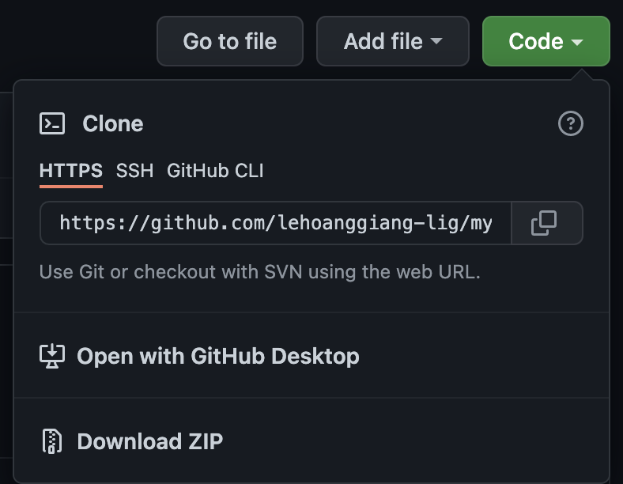

# First steps (git clone, basic commands for status check)

## Create a new repository on Github
- Log in to your Github account. On the left column, you'll see the create new repository button in green.

  

## Create a local repo on your computer (clone of the repo on Github)
> リモートリポジトリをcloneして自分のパソコンでローカルリポジトリを作る
- Go to the repo you just created on Github. Get the URL of your repo by clicking the code button in green

  
- Open terminal on your computer, see which directory you're currently on by using command ```$ pwd```
```$ cd directory_name``` to the directory you want to save the repo to.
- Use command ```$ git clone your_repo_url``` to clone the repo to your computer. This will be your ```local repository```.

## Basic commands for status check
- ```$ pwd```: to check which directory (in your computer) you're currently on.
- ```$ cd directory_name```: to switch to desired directory.
- ```$ git branch```: to see a list of branches in your local repo.
- ```$ git branch -a```: to see a list of all branches, both in your local repo and in your remote repo.
- ```$ ls```: to see name of all files in the branch you're on
- ```$ ls -l```: to see name of all files and your access authority to those files